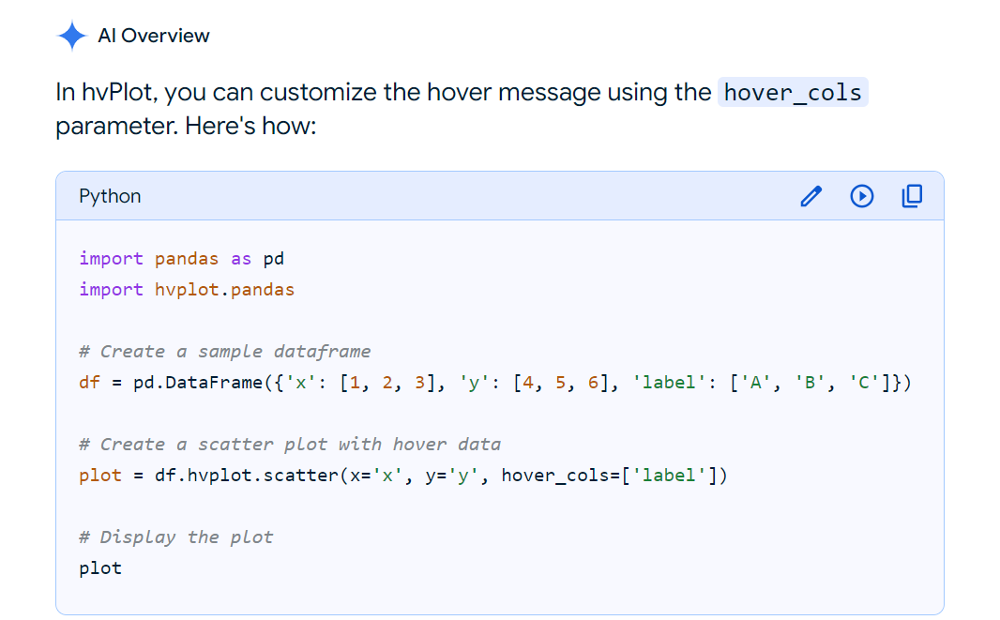

# python-api-challenge
For the second part of this assignment involving finding the closest hotels to vacation spots with our preferred weather, I used Google AI to lookup how to add fields to the hover message for the map plot showing our ideal vacation spots. I googled 'hvplot hover message,' and the following appeared, and I changed the parameter, 'hover_cols,' as shown below.

